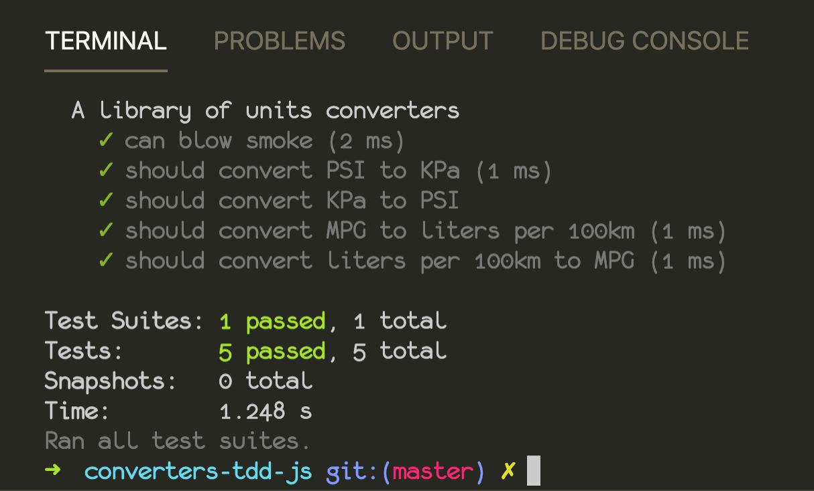

# Units Converters Created Following TDD with Jest

A library of units converters following the TDD process in JavaScript.

Here is a screenshot of the tests running successfully:

The most interesting thing I noticed while developing this project is that the units conversion tool on Google (specifically PSI => KPa) produces potentially inaccurate results. When I did the same calculation by hand, I found that even when you round, you don't get the same answer. That undoubtedly means that there's a problem with the precision somewhere, but I did not figure out whether or not it is a problem with the various conversion constants I looked up or if Google's conversions are just being rounded off too soon somewhere.
